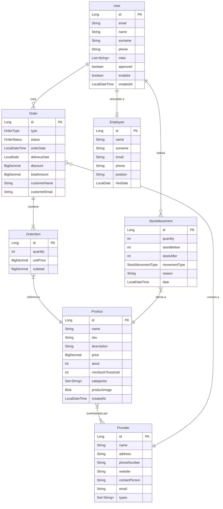
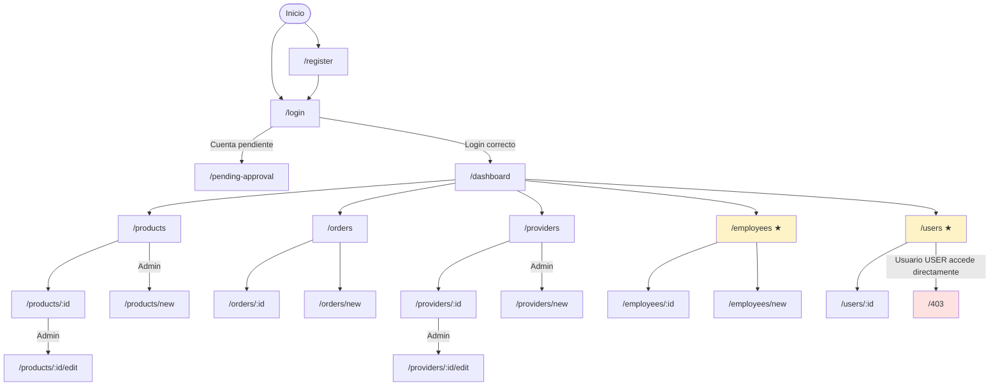
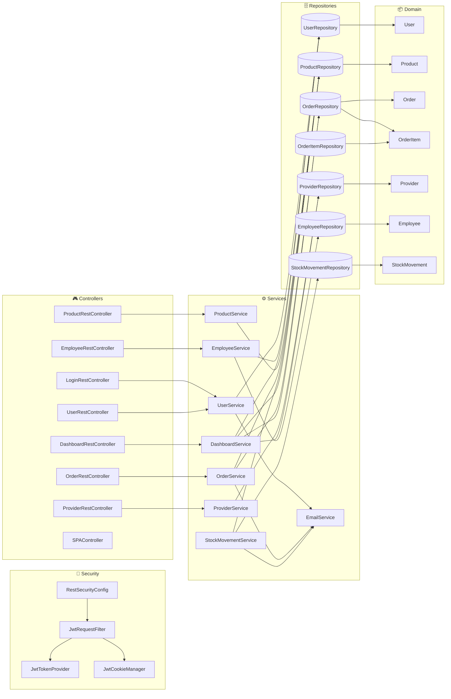
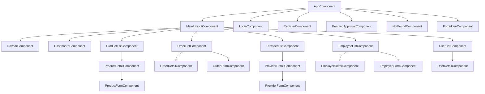
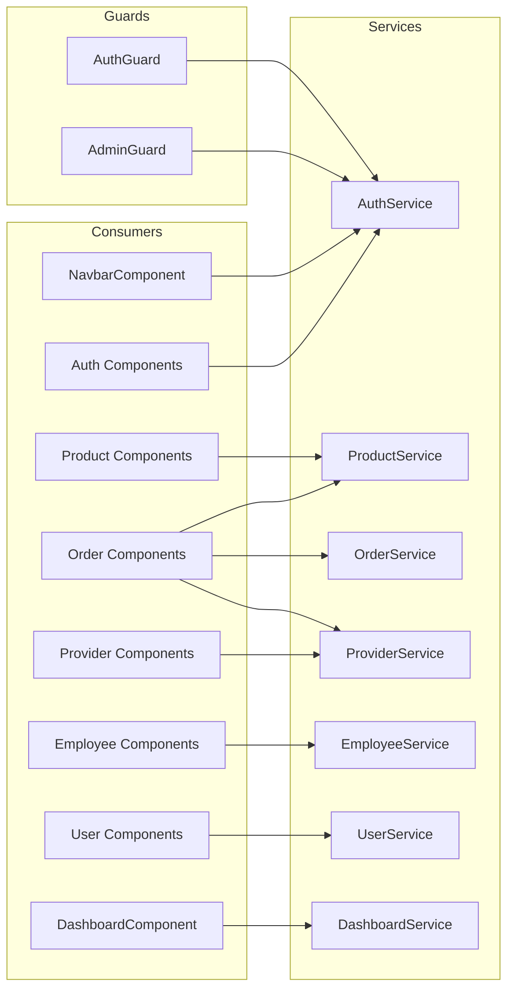

# Shopventory

Aplicación web de gestión de inventario para pequeños negocios. Permite registrar productos, controlar el stock en tiempo real, gestionar pedidos de compra y venta, y visualizar métricas clave del negocio a través de un dashboard interactivo con gráficos. Incluye autenticación con roles diferenciados y alertas automáticas por correo cuando el stock de un producto cae por debajo de un umbral configurable.

- **Alumno:** Alberto Jesús García Guerra
- **Tutor:** Óscar Soto Sánchez
- **Tablón de tareas:** [TFG Shopventory – Trello](https://trello.com/b/zNriPdj8/tfg-shopventory)

---

## Capturas de pantalla


---

## Funcionalidades

### Básicas

| Funcionalidad | Descripción |
|---|---|
| Autenticación | Registro, login y logout con JWT en cookies HttpOnly |
| Aprobación de usuarios | Los nuevos registros requieren aprobación de un administrador |
| Gestión de productos | CRUD completo con SKU, precio, stock, categorías e imagen |
| Control de stock | Movimientos de entrada y salida con registro histórico |
| Gestión de pedidos | Pedidos de compra y venta con líneas de producto y estados |
| Gestión de proveedores | CRUD de proveedores asociados a productos |
| Gestión de empleados | CRUD de empleados (solo administrador) |
| Gestión de usuarios | Aprobación, habilitación y deshabilitación de cuentas |
| Control de acceso | Roles ADMIN y USER con rutas protegidas |
| Páginas de error | Páginas personalizadas 403 y 404 |

### Avanzadas

| Funcionalidad | Descripción |
|---|---|
| Dashboard con métricas | KPIs de inventario, ventas, pedidos pendientes y alertas de stock |
| Gráficos interactivos | Distribución por categorías, top productos y productos con bajo stock |
| Alertas por correo | Notificación automática cuando un producto baja del umbral mínimo de stock |
| Imagen de producto | Subida, visualización y eliminación de imagen por producto |
| API REST documentada | Documentación OpenAPI 3.1 completa de todos los endpoints |

---

## Entidades y relaciones



---

## Roles de acceso

### ADMIN
- Acceso completo a todas las secciones de la aplicación
- CRUD de productos, proveedores y empleados
- Gestión de usuarios: aprobar, habilitar y deshabilitar cuentas
- Crear y gestionar pedidos de compra y venta
- Recibe notificaciones por correo ante alertas de stock bajo
- Es dueño de las entidades: `Product`, `Provider`, `Employee`, `User`

### USER (usuario estándar)
- Consultar listado y detalle de productos
- Registrar movimientos de stock
- Crear y consultar pedidos
- Consultar proveedores
- No tiene acceso a la gestión de usuarios ni empleados
- No puede crear, editar ni eliminar productos ni proveedores
- Es dueño de los pedidos (`Order`) que él mismo crea

> Los usuarios recién registrados quedan en estado pendiente hasta que un administrador los aprueba.

---

## Descripción detallada por funcionalidad

### Autenticación
| Funcionalidad | ADMIN | USER |
|---|:---:|:---:|
| Registro de cuenta | ✅ | ✅ |
| Login / Logout | ✅ | ✅ |
| Aprobación de nuevas cuentas | ✅ | — |
| Habilitar / deshabilitar cuentas | ✅ | — |

### Dashboard
| Funcionalidad | ADMIN | USER |
|---|:---:|:---:|
| KPIs: productos, pedidos, ventas, alertas | ✅ | ✅ |
| Gráfico de distribución por categoría (doughnut) | ✅ | ✅ |
| Gráfico de productos con más stock (barras) | ✅ | ✅ |
| Gráfico de productos con menos stock (barras) | ✅ | ✅ |

### Productos
| Funcionalidad | ADMIN | USER |
|---|:---:|:---:|
| Ver listado paginado y búsqueda | ✅ | ✅ |
| Ver detalle de producto | ✅ | ✅ |
| Crear / Editar / Eliminar producto | ✅ | — |
| Subir / eliminar imagen | ✅ | — |
| Registrar movimiento de stock | ✅ | ✅ |

### Pedidos
| Funcionalidad | ADMIN | USER |
|---|:---:|:---:|
| Ver listado y detalle | ✅ | ✅ |
| Crear pedido de venta o compra | ✅ | ✅ |
| Confirmar / entregar / cancelar pedido | ✅ | ✅ |
| Eliminar pedido | ✅ | — |

### Proveedores
| Funcionalidad | ADMIN | USER |
|---|:---:|:---:|
| Ver listado y detalle | ✅ | ✅ |
| Crear / Editar / Eliminar proveedor | ✅ | — |

### Empleados
| Funcionalidad | ADMIN | USER |
|---|:---:|:---:|
| Ver listado y detalle | ✅ | — |
| Crear / Editar / Eliminar empleado | ✅ | — |

### Usuarios
| Funcionalidad | ADMIN | USER |
|---|:---:|:---:|
| Ver listado y detalle | ✅ | — |
| Aprobar / habilitar / deshabilitar cuenta | ✅ | — |

---

## Tecnología complementaria

**Envío de correos electrónicos** mediante Spring Mail (SMTP sobre Gmail). Cuando el stock de un producto cae por debajo de su umbral mínimo configurable — por un movimiento manual o por la confirmación de un pedido de venta — el sistema envía automáticamente una notificación por correo a todos los administradores. Las credenciales se inyectan como variables de entorno en tiempo de despliegue, sin quedar almacenadas en el repositorio.

---

## Algoritmo avanzado: control de stock con umbral configurable

Tras cada actualización de stock, el servicio verifica si el nuevo nivel cruza por debajo del umbral mínimo (`minStockThreshold`). La alerta solo se envía en el momento del cruce — no en cada movimiento si el stock ya estaba por debajo — evitando duplicar notificaciones. El mismo mecanismo se activa al confirmar pedidos de venta que descuenten unidades de varios productos.

La consulta avanzada del dashboard agrupa los productos por categoría con una query JPQL sobre una colección `@ElementCollection`, calculando la distribución sin duplicar información en el modelo.

---

## Capturas de pantalla por pantalla

<!-- CAPTURA: login -->
**Login** — Formulario de acceso con enlace a registro.

<!-- CAPTURA: register -->
**Registro** — Formulario de creación de cuenta; queda pendiente de aprobación.

<!-- CAPTURA: dashboard -->
**Dashboard** — KPIs del negocio y gráficos de inventario.

<!-- CAPTURA: product-list -->
**Productos** — Listado paginado con búsqueda y alertas de bajo stock.

<!-- CAPTURA: product-detail -->
**Detalle de producto** — Información completa, imagen y movimientos de stock.

<!-- CAPTURA: order-list -->
**Pedidos** — Listado de ventas y compras con estado.

<!-- CAPTURA: order-form -->
**Nuevo pedido** — Formulario con selección de productos y proveedor.

<!-- CAPTURA: provider-list -->
**Proveedores** — Listado con búsqueda.

<!-- CAPTURA: employee-list -->
**Empleados** — Solo visible para administradores.

<!-- CAPTURA: user-list -->
**Usuarios** — Gestión de cuentas y aprobaciones (solo administrador).

---

## Diagrama de navegación



> Las rutas en amarillo (\*) son exclusivas del rol **ADMIN**.

---

## Ejecución

### Requisitos

- [Docker Desktop](https://www.docker.com/products/docker-desktop/) (versión 24+)

### Descargar el docker-compose.yml

Descarga el fichero desde el repositorio:

```bash
curl -O https://raw.githubusercontent.com/codeurjc-students/Shopventory/main/docker/docker-compose.yml
```

### Configurar variables de entorno

Crea un fichero `.env` en el mismo directorio que `docker-compose.yml`:

```env
DB_PASSWORD=tu_contraseña_de_base_de_datos
JWT_SECRET=tu_clave_secreta_jwt_de_al_menos_32_caracteres
MAIL_USERNAME=tu_cuenta@gmail.com   # opcional
MAIL_PASSWORD=tu_app_password       # opcional
```

### Iniciar y parar

```bash
# Iniciar
docker-compose up -d

# Parar (conserva los datos)
docker-compose down

# Parar y eliminar también la base de datos
docker-compose down -v
```

La aplicación queda disponible en **https://localhost**.

### Credenciales de acceso

| Rol | Email | Contraseña | Estado |
|---|---|---|---|
| Administrador | `admin@shopventory.com` | `Admin1234!` | Aprobado |
| Usuario estándar | `user@shopventory.com` | `User1234!` | Aprobado |
| Usuario pendiente | `pending@shopventory.com` | `Pending1234!` | Pendiente de aprobación |

### Datos de ejemplo

| Entidad | Cantidad |
|---|---|
| Proveedores | 5 (TechSupplies, FoodDistrib, OfficeWorld, SportGear, GlobalImport) |
| Productos | 16 (Electronics, Food, Office, Sports) |
| Empleados | 4 |
| Pedidos | 7 (ventas y compras en distintos estados) |

---

## Desarrollo

### Herramientas

| Herramienta | Versión |
|---|---|
| Java (JDK) | 21 |
| Maven (wrapper incluido) | 3.9+ |
| Spring Boot | 3.4.5 |
| TypeScript | 5.2 |
| Node.js | 20.18.0 |
| Angular | 17 |
| MySQL | 8.0 |
| Docker Desktop | 24+ |

### Ciclo de desarrollo

**Backend:**
```bash
cd backend
.\mvnw.cmd spring-boot:run
# Con H2 en memoria (sin MySQL local):
.\mvnw.cmd spring-boot:run -Dspring-boot.run.profiles=test
```

**Frontend:**
```bash
cd frontend
npm install
npm start    # ng serve → http://localhost:4200 (proxy al backend en 8443)
```

**Build completo (JAR con frontend incluido):**
```bash
cd backend
.\mvnw.cmd package -DskipTests=true
# Sin compilar Angular (más rápido):
.\mvnw.cmd package -DskipTests=true -DskipFrontend=true
```

---

### Diagrama de clases del backend



---

### Diagrama de componentes del frontend

**Jerarquía de componentes:**



**Servicios y guards:**



---

### API REST

La API está documentada con OpenAPI 3.1. Para invocar endpoints que requieren autenticación, obtén primero las cookies de sesión:

```bash
# Login (guarda las cookies)
curl -k -c cookies.txt -X POST https://localhost:8443/api/auth/login \
  -H "Content-Type: application/json" \
  -d '{"username":"admin@shopventory.com","password":"Admin1234!"}'

# Petición autenticada
curl -k -b cookies.txt https://localhost:8443/api/products
```

**Referencia completa de la API:**
[Ver documentación OpenAPI](https://raw.githack.com/codeurjc-students/Shopventory/main/backend/api-docs/api-docs.html)

---

### Ejecución de tests

```bash
cd backend

# Todos los tests (compila Angular + JUnit + Selenium)
.\mvnw.cmd test

# Solo backend, sin Angular (Selenium se omite automáticamente)
.\mvnw.cmd test -DskipFrontend=true
```

La suite incluye 76 tests: 56 unitarios (Mockito), 8 de integración (MockMvc) y 12 Selenium (Edge headless sobre HTTPS).

---

### Publicar una release

1. Actualizar la versión en `backend/pom.xml`, `docker/Dockerfile`, `frontend/package.json` y `backend/api-docs/api-docs.yaml`
2. Commit + merge a `main` → el workflow de GitHub Actions publica automáticamente `tomy014/shopventory:latest` en Docker Hub
3. Actualizar `docker/docker-compose.yml` para referenciar el tag de versión explícito:
   ```yaml
   image: tomy014/shopventory:1.0.0
   ```
4. Crear la GitHub Release con el tag `vX.Y.Z` sobre `main`
